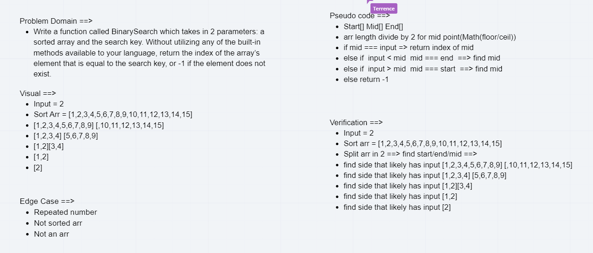

# Array Binary Search

- Write a function called BinarySearch which takes in 2 parameters: a sorted array and the search key. Without utilizing any of the built-in methods available to your language, return the index of the array’s element that is equal to the search key, or -1 if the element does not exist.
<!-- Short summary or background information -->

## Challenge

- Binary search in a sorted 1D array
<!-- Description of the challenge -->

## Approach & Efficiency
<!-- What approach did you take? Why? What is the Big O space/time for this approach? -->

- Find start/end/mid ==> 
- divide array in half
- Return index of mid if mid matches input
- Else => find the middle of the side that likely has input 
- Return index of mid if mid matches input
- Repeat as needed and return input index if exists
- Else => return -1.

## Solution
<!-- Embedded whiteboard image -->
