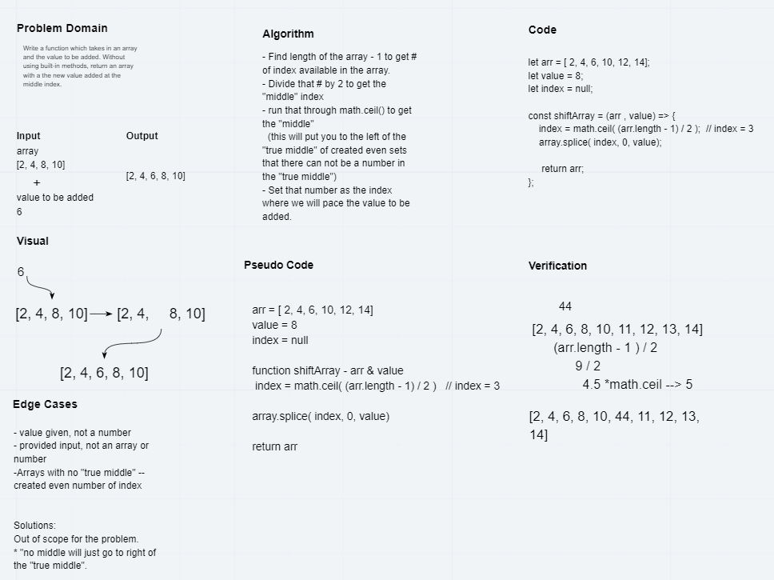

# Shift an Array

- Write a function called insertShiftArray which takes in an array and the value to be added. Without utilizing any of the built-in methods available to your language, return an array with the new value added at the middle index.
<!-- Short summary or background information -->

## Challenge

- Insert and shift an array in middle at index
<!-- Description of the challenge -->

## Approach & Efficiency
<!-- What approach did you take? Why? What is the Big O space/time for this approach? -->

- Find the middle -> divide length by 2
- save value of middle
- insert the input with the value of middle as the index

## Solution
<!-- Embedded whiteboard image -->

