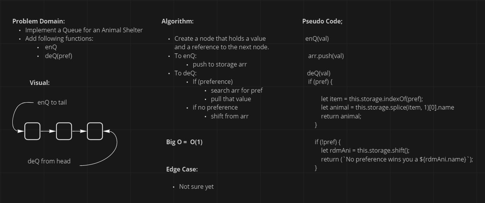

# First-in, First out Animal Shelter.

<!-- Short summary or background information -->

## Challenge

- Using a Queue, create a system for managing animal objects
<!-- Description of the challenge -->

## Approach & Efficiency
<!-- What approach did you take? Why? What is the Big O space/time for this approach? -->

- Use an arr as storage
- Use conditionals to select the preference

## Solution
<!-- Embedded whiteboard image -->

