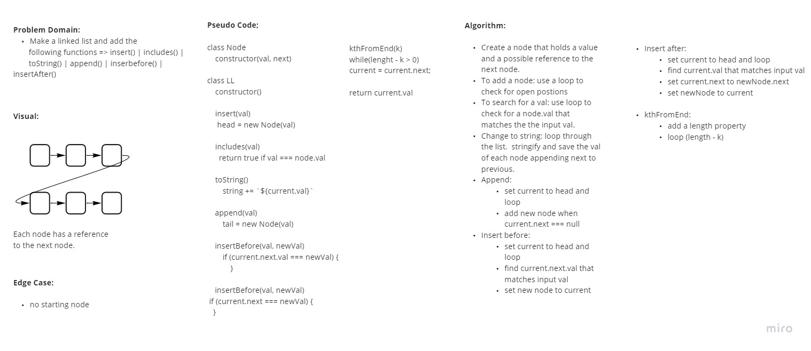

# Linked List

- Create a linked list that 
<!-- Short summary or background information -->

## Challenge

- Create a Node class that has properties for the value stored in the Node, and a pointer to the next Node.
- Within your LinkedList class, include a head property. Upon instantiation, an empty Linked List should be created.
    - Define a method called insert which takes any value as an argument and adds a new node with that value to the head of the list with an O(1) Time performance.
    - Define a method called includes which takes any value as an argument and returns a boolean result depending on whether that value exists as a Node’s value somewhere within the list.
    - Define a method called toString (or __str__ in Python) which takes in no arguments and returns a string representing all the values in the Linked List, formatted as:
        - "{ a } -> { b } -> { c } -> NULL"
<!-- Description of the challenge -->

## Approach & Efficiency
<!-- What approach did you take? Why? What is the Big O space/time for this approach? -->

- Node class
    - val and next
- insert  
    - find last position
    - insert val
- includes 
    - find node.val that matches input val
- toString
    - stringify and save the val of each node appending next to previous.
- insertBefore 
    - find node.val that matches input val
    - insert val before
- insertAfter 
    - find node.val that matches input val
    - insert val after
- kthFromEnd
    - loop list(lenght minus input val)

## Solution
<!-- Embedded whiteboard image -->

