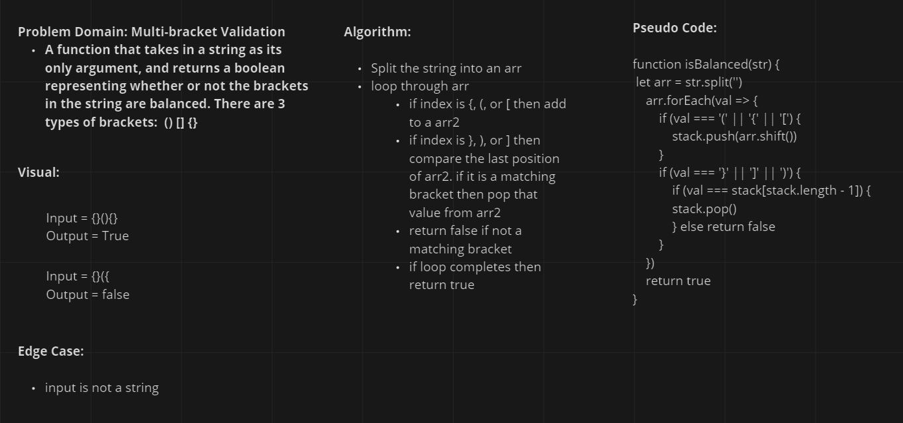

# Balanced Bracket

<!-- Short summary or background information -->

## Challenge

- Given a string as input verify whether the brackets in that string a balanced. Ex: Input = {}(){} Output = True
<!-- Description of the challenge -->

## Approach & Efficiency
<!-- What approach did you take? Why? What is the Big O space/time for this approach? -->

- Split the input string into an array;
- Loop through the arr and stack all open brackets
- All closing brakets are compared to the top of the stack: if the open matches the closing then pop the open from the stack. If no match then false.
- If the loop finishs return true

## Solution
<!-- Embedded whiteboard image -->

