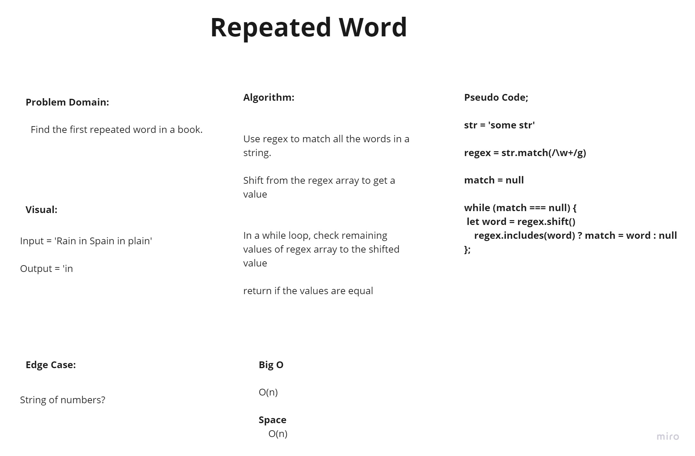

# Repeated Word
<!-- Short summary or background information -->

## Challenge

- Find the first repeated word in a book(string).

## Approach & Efficiency
<!-- What approach did you take? Why? What is the Big O space/time for this approach? -->

- Use regex to match all the words in a string.

- Shift from the regex array to get a value

- In a while loop, check remaining values of regex array to the shifted value

- return if the values are equal

## WB

