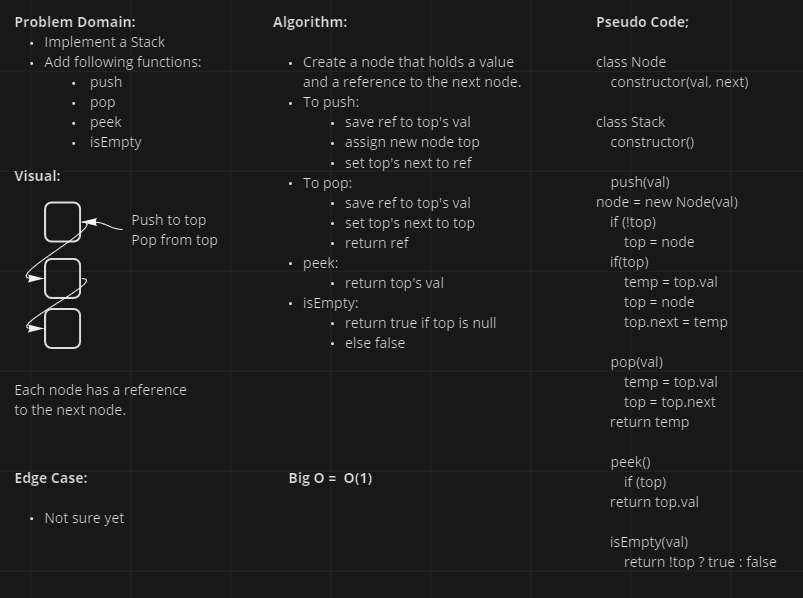
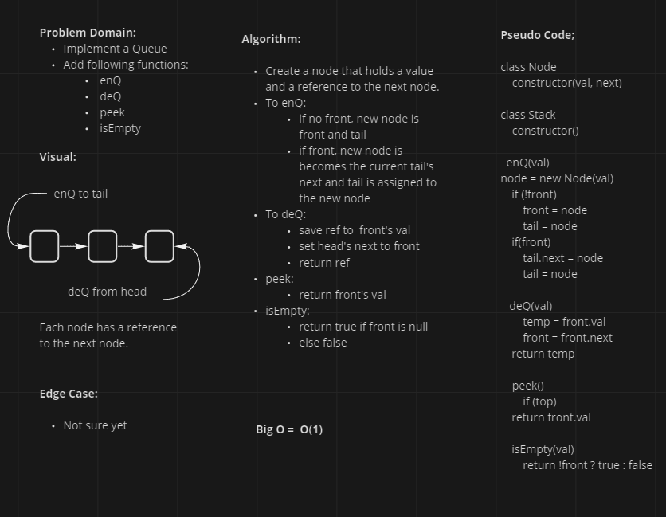
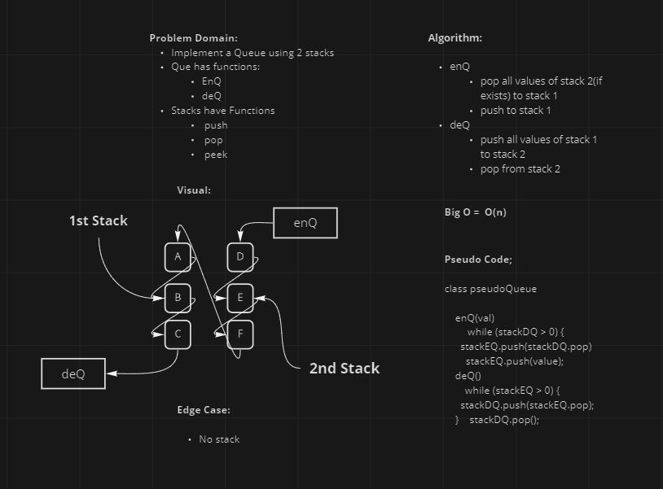

# Stacks/Queues

- Implement standard stack and queue methods
<!-- Short summary or background information -->

## Challenge

- Create a stack and add push, pop, peek, and isEmpty functions
- Create a queue and add enQueue, DeQueue, peek, and isEmpty functions
- Create a psuedoQueue using 2 stacks and add enQueue, DeQueue functions
<!-- Description of the challenge -->

## Approach & Efficiency
<!-- What approach did you take? Why? What is the Big O space/time for this approach? -->

- Keeping references to top and next when making changes to the stack
- Keeping references to head, tail, and next when making changes to the queue
- Push values back and forth between stacks when enQ/deQ

## Solution
<!-- Embedded whiteboard image -->

#### Stacks

#### Queues

#### pseudoQueue

