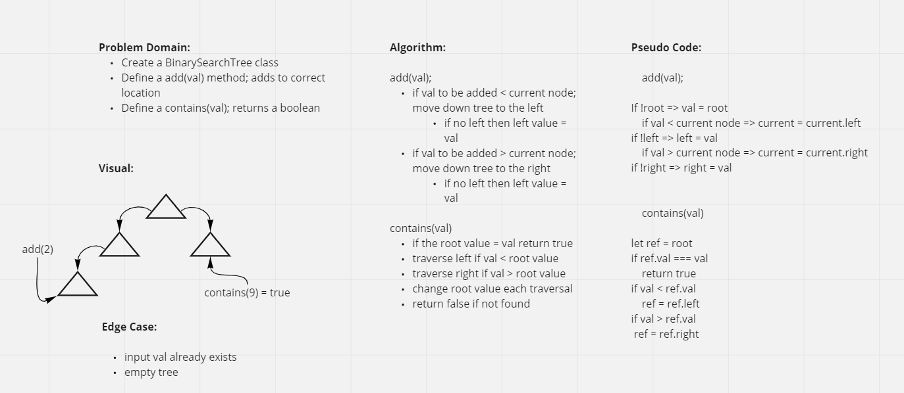
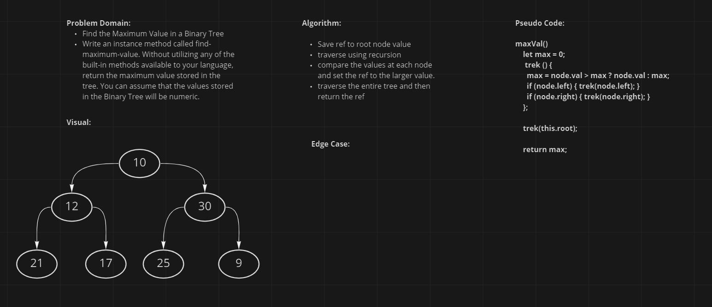

# Trees

<!-- Short summary or background information -->

## Challenge

- Create BST with add() and contains()
- Create a BinaryTree class
    - Define a method for each of the depth first traversals called preOrder, inOrder, and postOrder which returns an array of the values, ordered appropriately.
<!-- Description of the challenge -->

## Approach & Efficiency
- preOrder, inOrder, and postOrder where provided in class
- Im not sure if my solution for add() and contains is the most effiect

#### WhiteBoard

- BT/BST

- maxVal()

