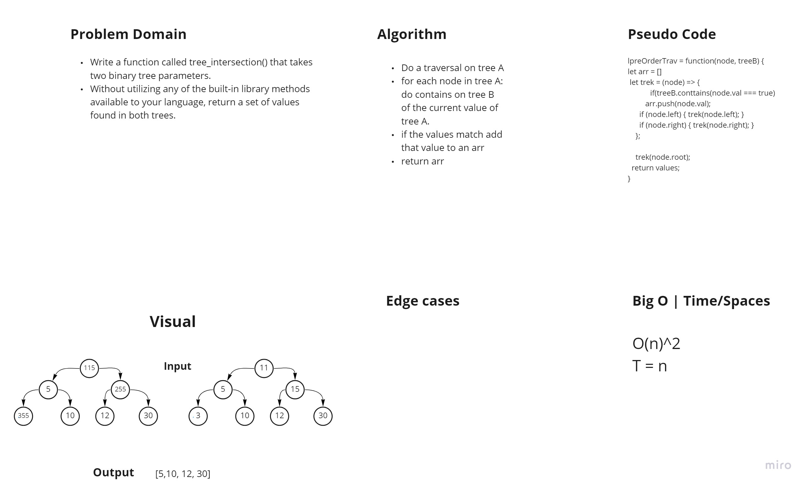

# Tree Instersection
<!-- Short summary or background information -->

## Challenge

- Write a function called tree_intersection() that takes two binary tree parameters.
- Without utilizing any of the built-in library methods available to your language, return a set of values found in both trees.

## Approach & Efficiency
<!-- What approach did you take? Why? What is the Big O space/time for this approach? -->

- Do a traversal on tree A
- for each node in tree A: do contains on tree B of the current value of tree A.
- if the values match add that value to an arr
- return arr;

## WB

